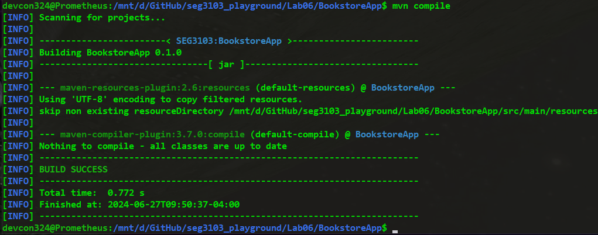
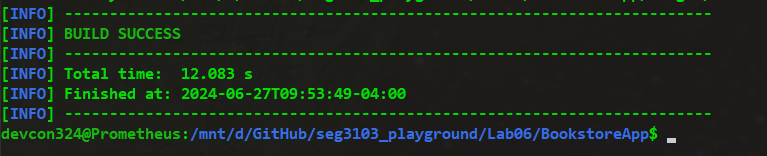
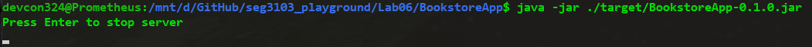
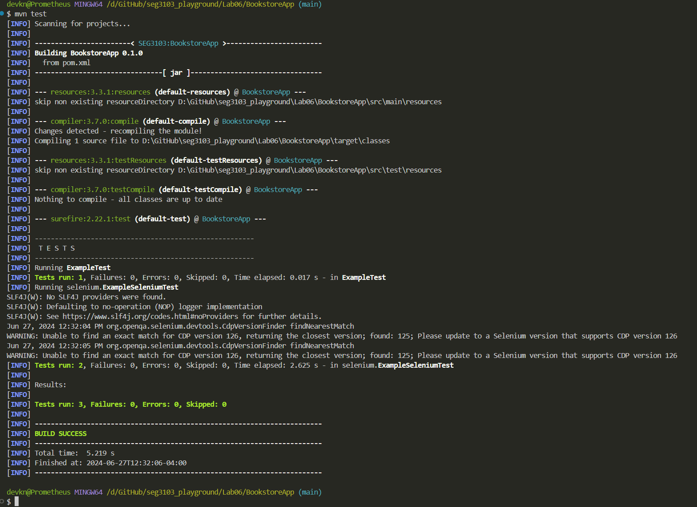
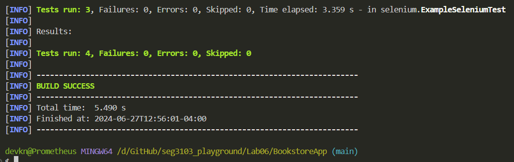

# seg3103_playground

## Lab 06

### Prerequisite Step

I compiled the Bookstore app with `mvn compile`


I packaged the app into a jar using `mvn package -DskipTests`


I started the server with `java -jar ./target/BookstoreApp-0.1.0.jar`


The app shows the server running this UI at `localhost:8080`


While running the server on a `Linux` terminal, I ran `mvn test` on `Windows` bash terminal to achieve functioning tests shown below. Note that after troubleshooting, this was the method that worked. running the tests on Linux terminal did not work.


I added a test to login as admin provided by the lab instructions

```java
@Test
  public void test3() {
    driver.get("http://localhost:8080/admin");
    WebElement username = driver.findElement(By.id("loginId"));
    WebElement password = driver.findElement(By.id("loginPasswd"));
    username.sendKeys("admin");
    password.sendKeys("password");

    WebElement sign_in = driver.findElement(By.id("loginBtn"));
    sign_in.click();

    WebDriverWait wait = new WebDriverWait(driver, Duration.ofSeconds(60));

    String actualUrl = driver.getCurrentUrl();
    String expectedUrl = "http://localhost:8080/admin";

    assertEquals(expectedUrl, actualUrl);
  }
```


