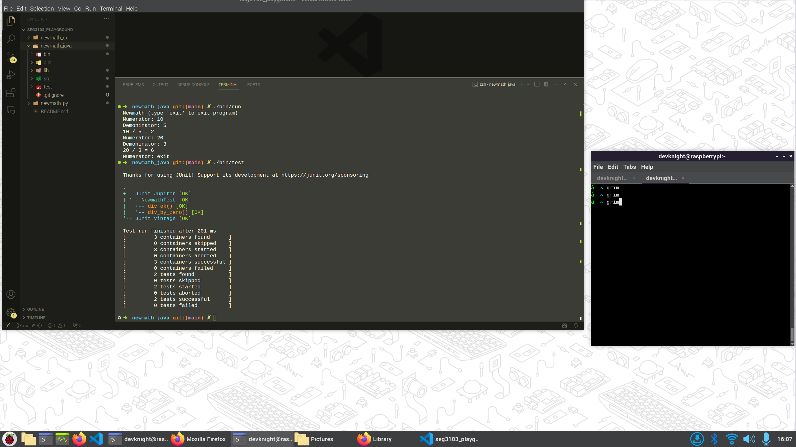
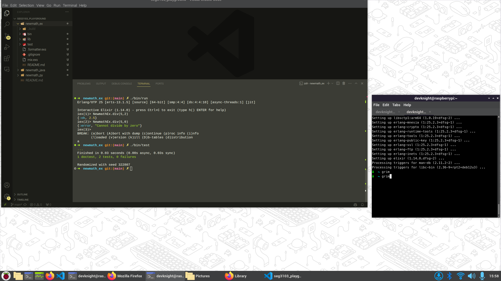
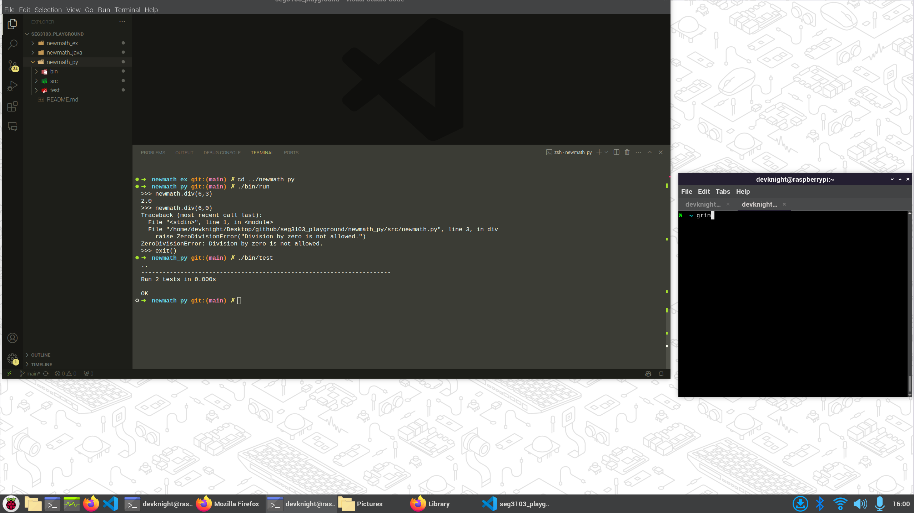

## Synopsis

This is SEG_2303_LAB_01 code and screenshots for understanding Git and Github and checking the installations of Java/JUnit, Elixir/ExUnit and Python/PyUnit

## Code Example

This library divides two numbers. start by running `./bin/run` in either the `newmath_java`, `newmath_ex`, or `newmath_py` directories

Example in `newmath_java`:

```bash
./bin/run 
Newmath (type 'exit' to exit program)
Numerator: 10
Demoninator: 5
10 / 5 = 2
Numerator: 20
Demoninator: 3
20 / 3 = 6
Numerator: exit
```

## Motivation

This project exists to ensure students have the development environment set up correctly

## Installation

```bash
# Installation
git clone https://github.com/Devcon324/seg3103_playground.git
```

## API Reference

https://junit.org/junit5/

https://hexdocs.pm/ex_unit/ExUnit.html

https://wiki.python.org/moin/PyUnit

## Tests

run tests with `./bin/test`

Example in `newmath_java`:

```bash
./bin/test        

Thanks for using JUnit! Support its development at https://junit.org/sponsoring

.
+-- JUnit Jupiter [OK]
| '-- NewmathTest [OK]
|   +-- div_ok() [OK]
|   '-- div_by_zero() [OK]
'-- JUnit Vintage [OK]

Test run finished after 201 ms
[         3 containers found      ]
[         0 containers skipped    ]
[         3 containers started    ]
[         0 containers aborted    ]
[         3 containers successful ]
[         0 containers failed     ]
[         2 tests found           ]
[         0 tests skipped         ]
[         2 tests started         ]
[         0 tests aborted         ]
[         2 tests successful      ]
[         0 tests failed          ]
```

## Screenshots to prove code can run





## Contributors

Devon Knight
300325369

## License

MIT License