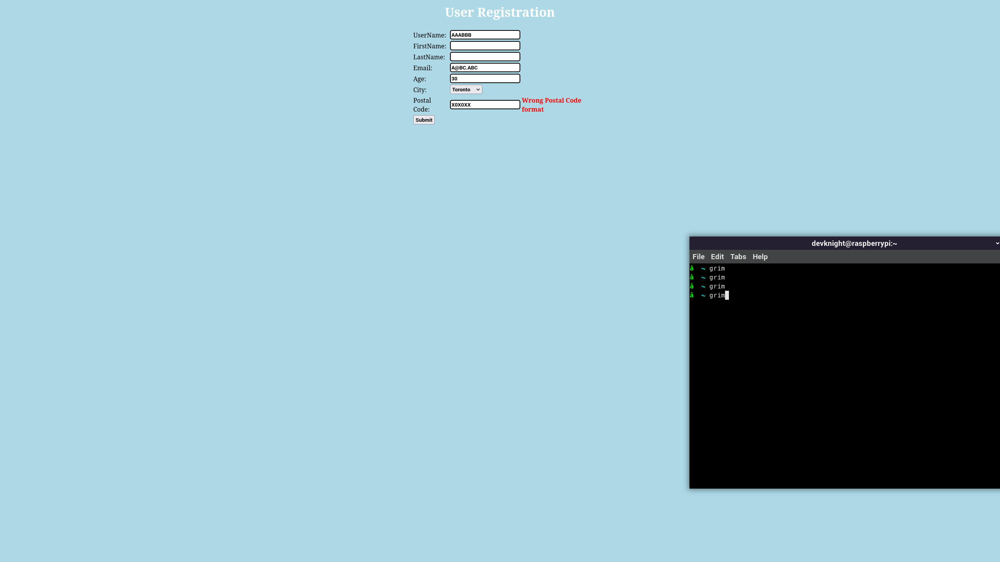
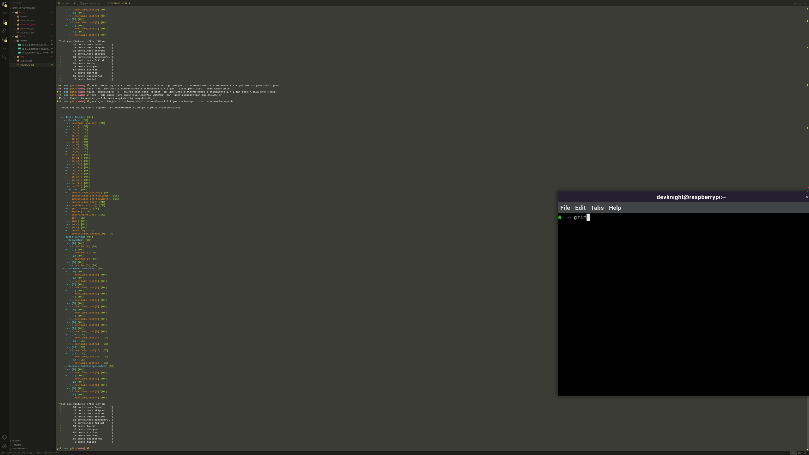

## Synopsis

This is SEG_2303_LAB_02 code and screenshots for understanding tests in Junit 5 for checking a date

# Exercise 1

Run the application with
```bash
java --add-opens java.base/java.lang=ALL-UNNAMED -jar  user-registration-app-0.1.0.jar
```

## Table of sample test cases fromt utorial

Test Case |  Expected Results             | Actual Results                   | Verdict(Pass, Fail, Inconclusive)
----------|-------------------------------|----------------------------------|----------------------------------
1         | registration request accepted | registration request accepted    | Pass
2         | registration request accepted | registration request accepted    | Pass
3         | registration request accepted | registration request accepted    | Pass
4         | registration request accepted | registration request accepted    | Pass
5         | Error1                        | Error1 and Error3                | Fail
6         | Error6                        | Error6                           | Pass
7         | Error8                        | Error8                           | Pass
8         | Error11                       | Error11                          | Pass

### Test 1, Success
```
UserName    = ABC123
FirstName   = 
LastName    = 
Email       = A@BC.ABC
Age         = 30
City        = Toronto
Postal Code = X0X0X0
```
### Test 2, Success
```
UserName    = AAAAAAABBBBBB
FirstName   = AAAAAAA
LastName    = AAAAAAA
Email       = AAaaAA@aA.AAA
Age         = 30
City        = Toronto
Postal Code = X0X0X0
```
### Test 3, Success
```
UserName    = AAAAAAAA
FirstName   = AAAAAAAA
LastName    = AAAA AAAA
Email       = AAaaAA@aA.AAABBB
Age         = 30
City        = Toronto
Postal Code = X0X0X0
```
### Test 4, Success
```
UserName    = ABC123
FirstName   = 
LastName    = 
Email       = A#@$BC
Age         = 30
City        = Toronto
Postal Code = X0X 0X0
```
### Test 5, Error, Wrong UserName format, Size of UserName must be between 6 and 12
```
UserName    = 
FirstName   = 
LastName    = 
Email       = A@BC.ABC
Age         = 30
City        = Toronto
Postal Code = X0X0X0
```
### Test 6, Error, Wrong Email Format
```
UserName    = AAABBB
FirstName   = 
LastName    = 
Email       = A#@$BC
Age         = 30
City        = Toronto
Postal Code = X0X0X0
```
### Test 7, Error, Age Not Provided
```
UserName    = AAABBB
FirstName   = 
LastName    = 
Email       = A@BC.ABC
Age         = 
City        = Toronto
Postal Code = X0X0X0
```
### Test 8, Error, Wrong Postal Code Format
```
UserName    = AAABBB
FirstName   = 
LastName    = 
Email       = A@BC.ABC
Age         = 30
City        = Toronto
Postal Code = X0X0XX
```

#### Visual of a success and Error

##### Success


##### Error


# Exercise 2

Compile ecs source code with:
```bash
javac -encoding UTF-8 --source-path src -d dist src/*.java
```
Compile ecs test code with:
```bash
javac -encoding UTF-8 --source-path test -d dist -cp lib/junit-platform-console-standalone-1.7.1.jar test/*.java src/*.java
```
Run ecs tests with
```bash
java -jar lib/junit-platform-console-standalone-1.7.1.jar --class-path dist --scan-class-path
```

See terminal capture of test reuslts
