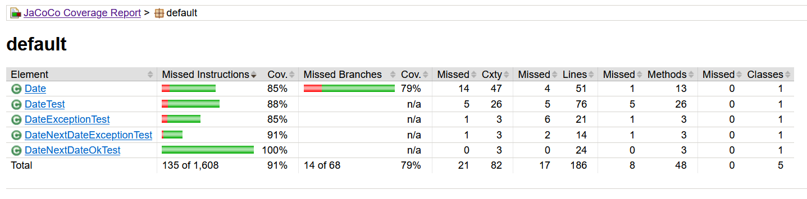
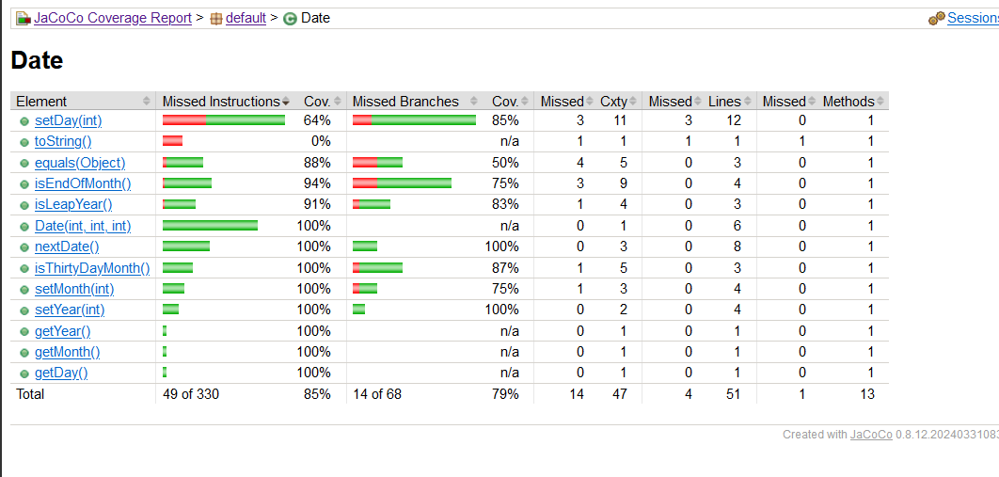

# seg3103_playground

## Lab 03

### steps to compile and run

Compile the app and test code with

```bash
javac -encoding UTF-8 --source-path src -d dist src/*.java && javac -encoding UTF-8 --source-path test -d dist -cp lib/junit-platform-console-standalone-1.7.1.jar test/*.java src/*.java
```

run app with

```bash
java -javaagent:lib/jacocoagent.jar -jar lib/junit-platform-console-standalone-1.7.1.jar --class-path dist --scan-class-path
```

create the report in html, opened with live server on browser

```bash
java -jar lib/jacococli.jar report jacoco.exec --classfiles dist --sourcefiles src --html report
```

Compilation


initial coverage report of computation


initial coverage report of date


initial coverage report of date's methods


### Exercise 1

Below is code added to the JUnit test suite.
This code covers 4 areas

- impossible endOfMonth days
- transition form feb to march in leap year
- missing september added
- date object equality with missing or correct info in all combinations
- Missing toString test added
- leap year on year where `year%400=0`

There is no way to reach 100% code coverage because two branches of logic

- It is impossible ot have a february without 29 days on a leap year.
- It is impossible for a month to be both be less than 1 and greater than 12.

This results in 97% overall branch coverage

```java
// Exercise 1: add tests
// Test cases for setDay()
// cant have a 32nd day on a month
@Test
void nextDate_invalid_setDay() {
    assertThrows(
            IllegalArgumentException.class,
            () -> new Date(2000, 3, 32));
}

// cant have 31st on a month with 30 days
@Test
void nextDate_invalid_setDay2() {
    assertThrows(
            IllegalArgumentException.class,
            () -> new Date(2000, 4, 31));
}

// cant have 30th day on a month with 29 days (leap year)
@Test
void nextDate_invalid_setDay3() {
    assertThrows(
            IllegalArgumentException.class,
            () -> new Date(2014, 2, 30));
}

// cant have 29th day on a month with 28 days
@Test
void nextDate_invalid_setDay4() {
    assertThrows(
            IllegalArgumentException.class,
            () -> new Date(2013, 2, 29));
}

// check if the next day is set correctly, non leap year
@Test
void nextDate_endOfFebNonLeap() {
    Date today = new Date(2021, 2, 28);
    Date expectedTomorrow = new Date(2021, 3, 1);
    assertEquals(expectedTomorrow, today.nextDate());
}

// check if the next day is set correctly, leap year
@Test
void nextDate_endOfFebLeap() {
    Date today = new Date(2020, 2, 28);
    Date expectedTomorrow = new Date(2020, 2, 29);
    assertEquals(expectedTomorrow, today.nextDate());
}

// missing september in tests
@Test
void nextDate_9month() {
    Date today = new Date(1901, 9, 1);
    Date expectedDayAfter = new Date(1901, 9, 2);
    assertEquals(expectedDayAfter, today.nextDate());
}

// compare date with object
@Test
void nextDate_equality1() {
    Object obj = new Object();
    Date date = new Date(2000, 3, 17);
    assertFalse(date.equals(obj));
}

// compare date with date wrong year month day
@Test
void nextDate_equality2() {
    Date date = new Date(2000, 3, 17);
    Date date2 = new Date(2001, 4, 18);
    assertFalse(date.equals(date2));
}

// compare date with date wrong month day
@Test
void nextDate_equality3() {
    Date date = new Date(2000, 3, 17);
    Date date2 = new Date(2000, 4, 18);
    assertFalse(date.equals(date2));
}

// compare date with date wrong day
@Test
void nextDate_equality4() {
    Date date = new Date(2000, 3, 17);
    Date date2 = new Date(2000, 3, 18);
    assertFalse(date.equals(date2));
}

// compare date with date wrong year day
@Test
void nextDate_equality5() {
    Date date = new Date(2000, 3, 17);
    Date date2 = new Date(2001, 3, 18);
    assertFalse(date.equals(date2));
}

// compare date with date wrong year month
@Test
void nextDate_equality6() {
    Date date = new Date(2000, 3, 17);
    Date date2 = new Date(2001, 4, 17);
    assertFalse(date.equals(date2));
}

// compare date with date correct
@Test
void nextDate_equality7() {
    Date date = new Date(2000, 3, 17);
    Date date2 = new Date(2000, 3, 17);
    assertTrue(date.equals(date2));
}

// ToString was not tested before
@Test
void nextDate_toString() {
    Date date = new Date(2000, 3, 17);
    assertEquals("2000/March/17", date.toString());
}

// check if the next day is set correctly, non leap year for year%400=0 year
@Test
void nextDate_isLeapYear_true() {
    Date today = new Date(2000, 2, 29);
    Date expectedDayAfter = new Date(2000, 3, 1);
    assertEquals(expectedDayAfter, today.nextDate());
}
```

### Exercise 2

setDay() was refactored to reduce to fewer if-statements as indicated on JoCoCo. which improved coverage to 90% branches covered. this is an improvement because there is less if-statements and thus less logic to fomr branches.

```java
private void setDay(int day) {
    // combined if statements here with OR gates since this is a range
    if (day < 1 || day > 31) {
        throw new IllegalArgumentException("day must be between 1 and 31.");
    }
    if (isThirtyDayMonth() && day > 30) {
        throw new IllegalArgumentException(
                "day must be less than or equal to 30 for month " + monthNames[month - 1]);
    }
    // combined if statements here with OR gates, this either a leap year or not
    if (this.month == 2 && ((isLeapYear() && day > 29) || (!isLeapYear() && day > 28))) {
        throw new IllegalArgumentException("day must be less than or equal to " + (isLeapYear() ? 29 : 28)
                + " for month " + monthNames[month - 1]);
    }
    this.day = day;
}
```

Refactor addressed coverage report issue


Date final coverage report
