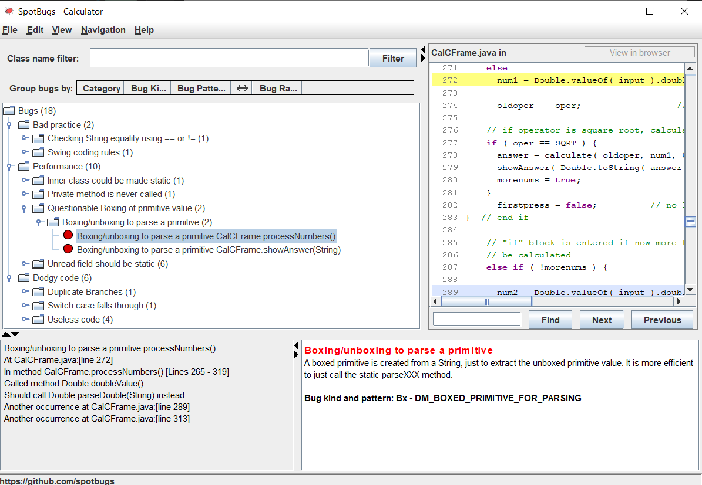

# seg3103_playground

## Lab 07

### Prerequisite Step

Compiled and run with following code:

```bash
# compile source
javac -encoding UTF-8 --source-path src -d dist src/*.java
#  compile test
javac -encoding UTF-8 --source-path test -d dist -cp dist:lib/junit-platform-console-standalone-1.7.1.jar test/*.java
# calculator
java -cp ./dist Main
# Spotbugs
java -jar ./lib/spotbugs/lib/spotbugs.jar
```

Calculator running:


### Bug 1 Comparison of String parameter using == or !=


Solved with

```java
public boolean clickCheck( String s ) {
  if ( s.equals("") )
    doubleclick = true;
  else
    doubleclick = false;

  return doubleclick;
}
```

### Bug 2 Certain swing methods needs to be invoked in Swing thread


Solved with adding SwingUtilities.invokeLater() which delays the GUI creation task until the first task is joined making it thread safe (yay operating systems class).

```java
import javax.swing.*;

public class Main {
  public static void main(String[] args) {
    SwingUtilities.invokeLater(new Runnable() {
      public void run() {
        JFrame frame = new CalCFrame("Calculator");
        frame.setSize(360,200);
        frame.setVisible(true);
      }
    });
  }
}
```

### Bug 3 Could be refactored into a named static inner class


Thsi requires a lot of refactoring, would need ot create a static inner inside of CalCFrame so it is a seperate class in the same file but can be called through instantiating its method.

### Bug 4 Private method is never called


Solved with

```java
// private void setClearscreen(CalCFrame cframe, boolean val) {
// 	try {
// 		Field f = cframe.getClass().getDeclaredField("clearscreen");
// 		f.setAccessible(true);
// 		f.setBoolean(cframe, val);
// 	} catch (NoSuchFieldException e) {
// 		// TODO Auto-generated catch block
// 		e.printStackTrace();
// 	} catch (SecurityException e) {
// 		// TODO Auto-generated catch block
// 		e.printStackTrace();
// 	} catch (IllegalArgumentException e) {
// 		// TODO Auto-generated catch block
// 		e.printStackTrace();
// 	} catch (IllegalAccessException e) {
// 		// TODO Auto-generated catch block
// 		e.printStackTrace();
// 	}
// }
```

### Bug 5 Boxing/unboxing to parse a primitive



Solved with parseDouble

```java
num2 = Double.parseDouble( input );
num3 = Double.parseDouble( input );
```

### Bug 6 Boxing/unboxing to parse a primitive


Solved with parseDouble

```java
answer = Double.parseDouble( s );
```

### Bug 7-12 Unread field: should this field be static?


Solved with

```java
  private static final int   ADD=1,        // integer constants representing operators
                      SUB = 2,
                      MULT = 3,
                      DIVI = 4,
                      POW = 5,
                      SQRT = 6;
```

### Bug 13 Method uses the same code for two branches


Solved with removing remaining else if replaced with else

```java
if ( i <= 2 )
    getContentPane().add( buttons[i] );
else if ( i >= 3 && i <= 7)
    getContentPane().add( buttons[i] );
else if ( i >=8 && i <= 12 )
    getContentPane().add( buttons[i] );
else
    getContentPane().add( buttons[i] );
```

### Bug 14 Switch statement found where default case is missing


Solved with a error throw for operators

```java
switch( oper ) {
  default: throw new IllegalArgumentException( "Invalid operator" );
  case ADD:
    answer = number1 + number2;
    break;
  case SUB:
    answer = number1 - number2;
    break;
  case MULT:
    answer = number1 * number2;
    break;
  case DIVI:
    answer = number1 / number2;
    break;
  case POW:
    answer = Math.pow( number1, number2 );
    break;
  case SQRT:
    answer = Math.sqrt( number1 );
    break;
} // end switch
```

### Bug 15-18 Condition has no effect


Solved with

```java
// add buttons to the frame
getContentPane().add( buttons[i] );

// add spaces between buttons to make the calculator look better
if ( i == 2 )
    getContentPane().add( new JLabel( "  " ) );
else if ( i == 7 )
    getContentPane().add( new JLabel( "  " ) );
else if ( i == 12 )
    getContentPane().add( new JLabel( "  " ) );
else if ( i == 17 )
    getContentPane().add( new JLabel( "  " ) );
```

and


```java
else {

  if ( equals ) {

    newoper = oper;
    morenums = false;
    firstpress = true;  // if equals is pressed set firstpress to false
} // end if

  num3 = Double.parseDouble( input );
  answer = calculate( newoper, answer, num3 );
  showAnswer( Double.toString(answer) );

  newoper = oper;
}  // end else if
```

### Final SpotBugs after refactoring

