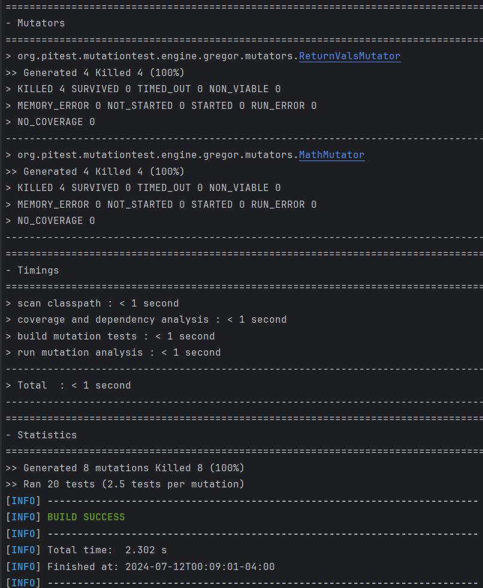
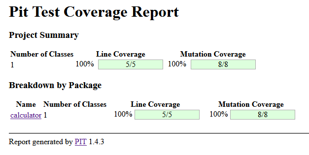
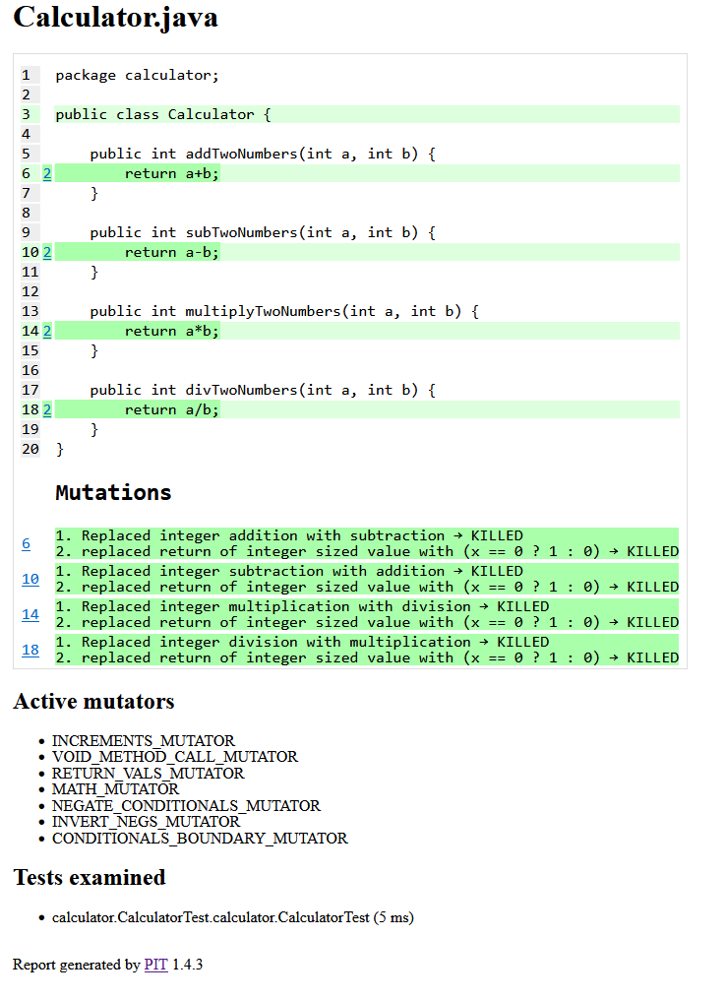

# seg3103_playground

## Lab 08

### Prerequisite Step

Compiled and run with following code:

```bash
#compile the project
mvn compile
# run PIT testing
mvn test-compile org.pitest:pitest-maven:mutationCoverage
```

### 1. Show at least one screenshot of starting the PIT Test plugin



### 2. Show at least 2 screenshots of the HTML report




### In your own words explain what the various mutations are doing and what the report tells you

the mutations shown in the report show that there are swaps of operators such as swapping addition with subtraction and multiplication with division and vice-versa.

There is also a list of active mutators described form PIT Test documentation

**INCREMENTS_MUTATOR**: The increments mutator will mutate increments, decrements and assignment increments and decrements of local variables (stack variables). It will replace increments with decrements and vice versa.
**VOID_METHOD_CALL_MUTATOR**: removes method calls to void methods
RETURN_VALS_MUTATOR: This mutator has been superseded by the new returns mutator set. See Empty returns, False returns, True returns, Null returns and Primitive returns.
**MATH_MUTATOR**: The math mutator replaces binary arithmetic operations for either integer or floating-point arithmetic with another operation.
**NEGATE_CONDITIONALS_MUTATOR**: The negate conditionals mutator will mutate all conditionals
**INVERT_NEGS_MUTATOR**: The invert negatives mutator inverts negation of integer and floating point variables.
**CONDITIONALS_BOUNDARY_MUTATOR**: The conditionals boundary mutator replaces the relational operators <, <=, >, >= with their boundary counterpart

### Explain what it means for a mutant to be killed

A mutant is killed when a test case is able to detect the mutant change and has a different console output or encounters an error when run against the mutant. This shows that the test case is catching that particular type of error.
