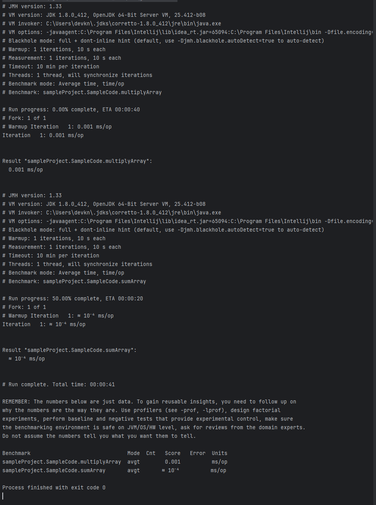
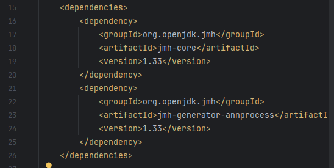
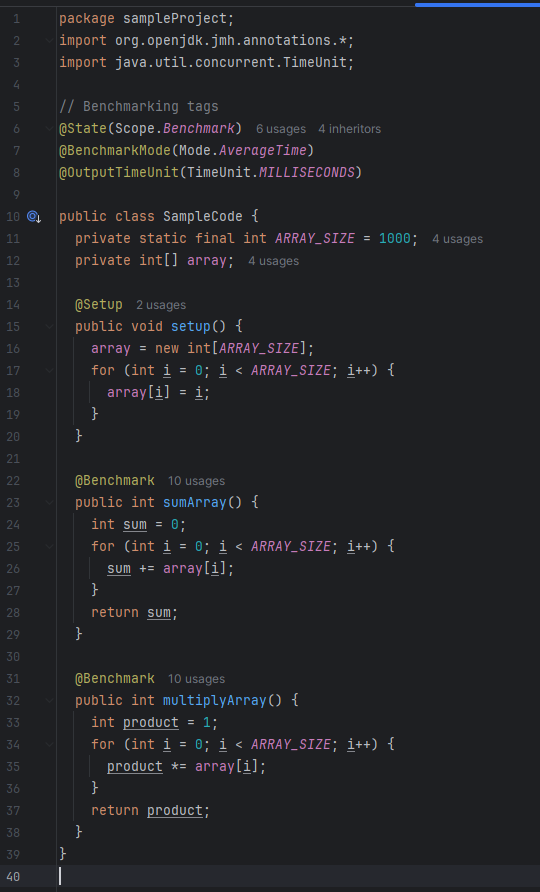

# seg3103_playground

## Lab 09

### Prerequisite Step

I made a sample maven project using the lab as a skeleton, sharing the same maven and jmh dependencies as requested.

I created a sample code that sets up an array with integers and sums the entire array with a loop, and multiplies the whole array with another loop.

I set the iterations to 1 for simplicity and for running quickly.

### 1. Show a screenshot of running JMH from the terminal/IDE

### 2. Show at least 2 screenshots your modified code with descriptions

Show pom.xml with the JMH dependency being included

Show your code using the @BenchmarkMode decorator

